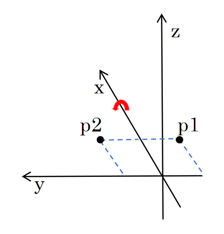
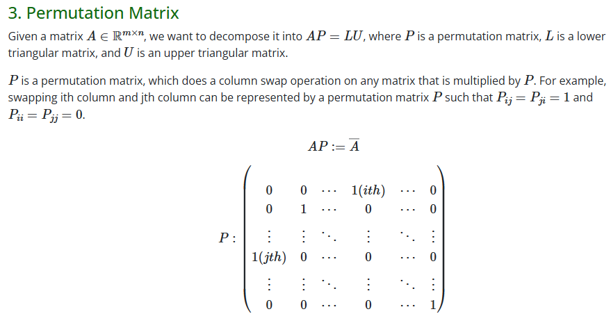

---
layout: essay
type: essay
title: "Understand Rotation in 3D Space, for beginners"
# All dates must be YYYY-MM-DD format!
date: 2025-03-01
published: true
labels:
  - Linear Algebra
  - Rigid Body Transformation
  - For Beginner
--- 

<!-- ***做无人机不学刚体变换就如同西方失去了耶路撒冷😈***   -->
# 三维空间中的几何描述
无人机在三维空间中的运动可以看作一个6DoF的刚体运动. 本文将从基础出发介绍三维空间中的平移和旋转.  
## 三维欧氏空间中的平移 
可以用一个三维欧氏空间$\mathbb{R}^3$来表示机体所在空间. 自然地, 机体的位置可以由向量 $p\in \mathbb{R}^3$ 表示.  
机体在空间中的位移可以由向量的加法表示.  

$$p_2=p_1+d$$  

其中$d\in \mathbb{R}^3$.  
显然, 这是一个线性变换, 也可以用向量线性变换的形式表出.  

$$p_2=Ap_1$$  

其中$A$可以由线性方程组$(A-I)p_1=d$ 解出. 我们称矩阵$A$为一个平移变换.  
## 旋转的定义  
旋转的表示并不像位移的表示那样容易. 抽象来讲, 旋转和位移都是和三维空间中质点一样, 有独立数学表示的概念. 但由于三维欧氏空间的良好特性, 可以很直观地将平移也表示在三维欧氏空间中, 也就是$d\in \mathbb{R}^3$.   

  

如果将旋转和平移都看作一种变换, 它们都能使三维空间中的质点位置发生改变. 比如在空间中, 点$p1$旋转到了$p2$. 自然地, 也可以用一个线性变换来表示三维空间中的旋转作用, 记作$R$.  

$$ p_2=Rp_1 $$  

接下来, 进一步描述$R$. 定义$R$描述了绕过原点的旋转轴$\phi$逆时针旋转$\theta$角度的旋转. 旋转轴可以用一个定义在三维欧氏空间中的向量表示, 既$\phi\in \mathbb{R}^3$.  
可以轻易地得出, 变换前后$p_1,p_2$的模长并不发生变化, 也就是说$R$是一个保距变换, 这意味着$R$是一个正交矩阵, $R$的行列式等于$\pm1$.  
事实上, 我们还想要保证变换后, 空间的手性不发生变化(空间还是右手系).  
三维空间的手性由空间一组基底的混合积判定,取欧氏空间的一组正交基$[e_1,e_2,e_3]$满足$e_1=e_2\times e_3$, 混合积为  

$$e_1\cdot(e_2\times e_3)$$  

混合积大于0, 则空间为右手系, 小于0则空间为左手系.  
对空间基底作旋转变换后, 新基底为$[r_1,r_2,r_3]$, 其中$r_1=Re_1,r_2=Re_2,r3=Re_3$. 新混合积为  

$$r_1\cdot (r_2\times r_3)=det(R)$$  

可以看到如果$R$的行列式为-1, 那么空间的手性会发生变化, 这是我们不希望看到的. 因此, 我们定义$R$的行列式为1.给出欧氏空间中绕过原点任意旋转轴的旋转的定义如下.  

$$SO3: \{ R\in\mathbb{R}^{3\times3}|R^TR=I, det(R)=1 \} $$  

以后可以知道, 上述集合和矩阵乘法构成特殊正交群$SO3$.  

***注意:*** 本节并没有给出$R$的解析形式. 事实上, 读者应该更应抽象地理解$R$. 如果需要了解, $R$的有多重表出方式,如, 余弦矩阵, 欧拉角表示, 四元数表示等, 搜索可以查到. 

## 旋转的作用
从这一节开始, 介绍旋转怎样作用于其他物理量.  
(这实际上是对旋转不同流形上元素的作用)  
### 旋转作用于向量
这实际上就是我们一开始对于旋转的定义. 对于空间中点$p$和相对于空间基底坐标系的旋转$R$, 旋转后得到的新点可以表示为  

$$p_{new}=Rp$$  

这是旋转对欧氏空间中元素的作用.

### 旋转作用于自身
旋转也同样可以对自身产生作用. 由于我们用三维矩阵表示旋转, 三维矩阵乘法不具有交换律, 能够很快发现旋转也有左乘和右乘区别.  
在谈论左右乘的区别之前, 先来看一个简单的例子.  
#### 置换矩阵 
置换矩阵是一个形如下图所示的矩阵, 它的作用是调换矩阵的行和列.  
$P$是一个对称矩阵, 当将$P$右乘与矩阵$A$时, A的某两列将会对换; 当将$P$左乘与矩阵$A$时, $A$的某两行将会对换. 可以联想, 假如把欧氏空间的基底看作一个列向量, 矩阵的左乘和右乘将会对旋转变换有不同的影响.   

  

图片来自 [LU Decompose](https://geniusdo.github.io/essays/math-detail.html)  

#### 左作用与右作用 
欧氏空间中经过点$p$, 实际上可以看作原点在欧氏空间的一组基底下经过平移变换得到的. 记欧氏空间中的一组基底为$[e_1,e_2,e_3]$, 有  

$$ p_=A[e_1, e_2, e_3]$$  

$$p_{new} = Rp=RA[e_1, e_2, e_3]$$  

此时, $R$对$A$这个变换左作用, 其表示在这个变换的基础之上相对于原本机体系做了旋转变换.  
而如果将R矩阵乘在变换$A$的右侧, 则为  

$$p_{new}=AR[e_1, e_2, e_3]=A[Re_1, Re_2, Re_3]$$  

则可以看作旋转$R$将空间基底做了旋转变换, 此时变换$A_{new}=AR$ 可以看作原来的点在新的基底下的表出.  
对于$R_1,R_2\in SO3$, 由于旋转对于矩阵乘法是封闭的, 所以$R=R_2R_1\in SO3$. 对于  

$$R_{new}=\delta R R$$  

表示旋转在原来坐标系(世界坐标系)下旋转了$\delta R$  

$$R_{new}= R\delta R$$  

表示旋转在自身坐标系(体坐标系)下旋转了$\delta R$

 
